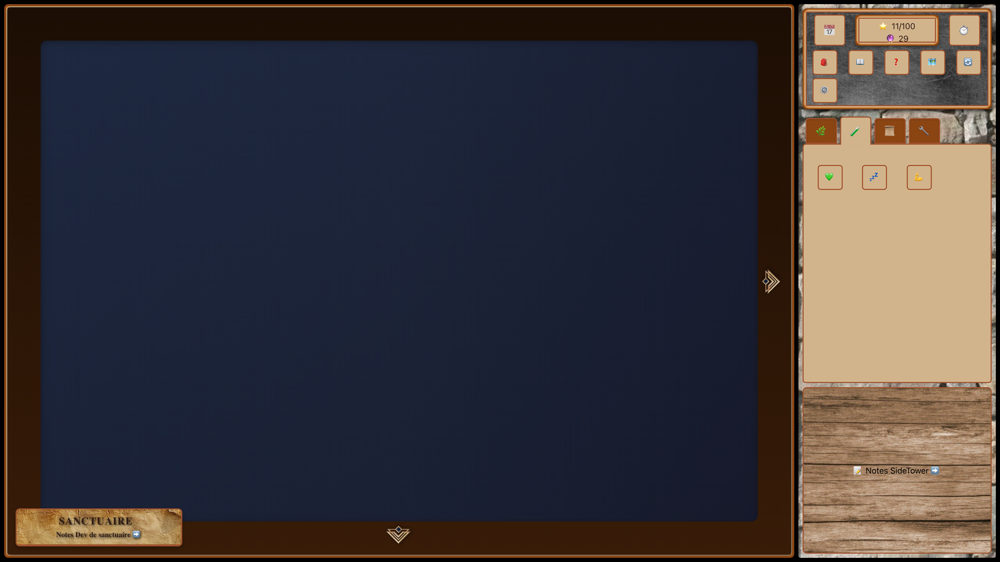
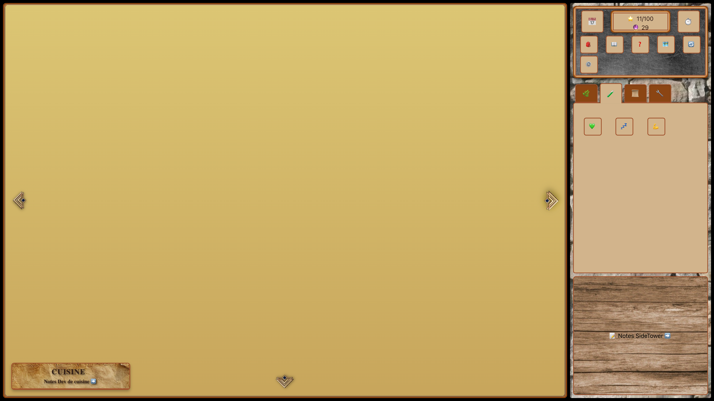
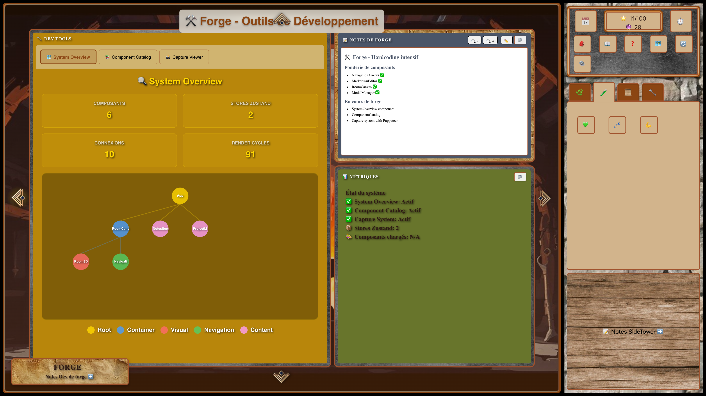
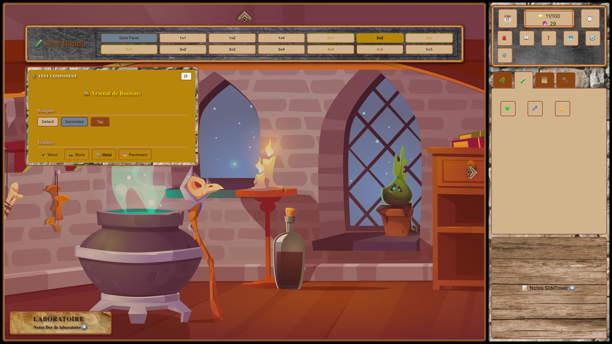

# 📸 Capture 2025-09-18T09-31-43

## 📊 Résumé
- **Date**: 18/09/2025 11:32:19
- **Rooms capturées**: 12
- **Stores Zustand**: 2
- **Fichiers totaux**: 110
- **Composants**: 12

## 📁 Contenu
- `state.json`: État complet des stores Zustand
- `rooms.json`: État et screenshots de chaque room (room1 à room12)
- `metrics.json`: Métriques du code
- `screenshots/`: Captures d'écran numérotées par position

## 🗺️ Mapping des Rooms
Grille 4x3 (x,y) - Numérotation de gauche à droite, ligne par ligne:

### Ligne 0 (y=0)
- room1 (0,0) | room2 (1,0) | room3 (2,0) | room4 (3,0)

### Ligne 1 (y=1)
- room5 (0,1) | room6 (1,1) | room7 (2,1) | room8 (3,1)

### Ligne 2 (y=2)
- room9 (0,2) | room10 (1,2) | room11 (2,2) | room12 (3,2)

## 🖼️ Screenshots avec positions
- **room1** (0,0): Roadmap - 
- **room2** (1,0): Roadmap - 
- **room3** (2,0): Roadmap - 
- **room4** (3,0): Roadmap - 
- **room8** (3,1): Roadmap - 
- **room7** (2,1): Roadmap - 
- **room6** (1,1): Roadmap - 
- **room5** (0,1): Roadmap - 
- **room9** (0,2): Roadmap - 
- **room10** (1,2): Roadmap - 
- **room11** (2,2): Roadmap - 
- **room12** (3,2): Roadmap - 

---
*Capturé automatiquement - Les rooms sont numérotées par position pour rester indépendant des changements de noms*
