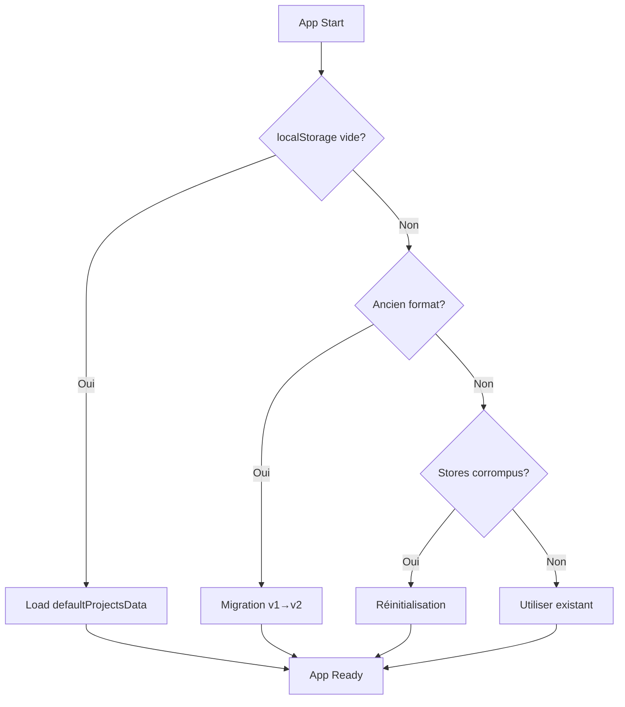

# Architecture Multi-Stores v2 - IRIM MetaBrain

## Vue d'ensemble

**Architecture modulaire** avec séparation des responsabilités entre métadonnées et données projet.

### Stores principaux

```
useNotesStore          → Notes transversales (infrastructure)
useProjectMetaStore    → Métadonnées globales des projets
useProjectDataStore    → Données spécifiques par projet (dynamique)
```

---

## Store: useProjectMetaStore

**Fichier:** `stores/useProjectMetaStore.js`
**Clé localStorage:** `project-meta-store`
**Version:** 2

### Responsabilité
Gestion centralisée des métadonnées de tous les projets.

### État
```js
{
  // Navigation
  selectedProject: string,              // ID projet actuel
  visibleProjects: string[],           // IDs projets visibles dans carousel

  // Organisation
  categories: {
    pro: { label, subcategories },
    perso: { label, subcategories },
    formation: { label, subcategories }
  },

  // Métadonnées projets
  projects: {
    [projectId]: {
      // Identité
      id: string,
      name: string,
      type: string,                   // tool|wellness|finance|creative
      status: string,                 // dev_actif|concept|vision

      // Catégorisation
      category: string,               // pro|perso|formation
      subcategory: string,

      // Propriétés enrichies
      contractType: string,
      deploymentStatus: string,       // local|staging|production|concept
      projectNature: string,
      technologies: string[],
      client: string,
      startDate: string,
      endDate: string,
      order: number,                  // Position dans la liste

      // Timestamps
      created_at: string,
      updated_at: string
    }
  }
}
```

### Actions principales
```js
// CRUD
createProject(projectData)
updateProjectMeta(projectId, updates)
deleteProject(projectId)

// Navigation
selectProject(projectId)
selectNextProject()
selectPreviousProject()

// Visibilité
toggleProjectVisibility(projectId)

// Organisation
reorderProjects(activeId, overId)
updateProjectCategory(id, cat, subcat)

// Helpers
getCurrentProject()
getVisibleProjects()
getProjectsSortedByOrder()
```

---

## Store: useProjectDataStore (Dynamique)

**Fichier:** `stores/useProjectDataStore.js`
**Clé localStorage:** `project-data-${projectId}` (un par projet)
**Version:** 1

### Responsabilité
Données spécifiques à chaque projet, créé dynamiquement à la demande.

### État
```js
{
  // Contenu Markdown
  roadmapMarkdown: string,
  todoMarkdown: string,

  // État modules Atelier
  atelierModules: {
    roadmap: { collapsed: boolean },
    todo: { collapsed: boolean },
    mindlog: { collapsed: boolean, mood: string, note: string },
    actions: { collapsed: boolean, items: array },
    screentv: { collapsed: boolean, screenshots: array }
  },

  // Legacy (conservé pour compatibilité)
  roadmap: array,
  todo: array,
  idees: array,
  prochaineAction: object
}
```

### Usage
```js
import { useProjectData } from './stores/useProjectDataStore';

// Dans un composant
const projectData = useProjectData(projectId);

// Actions disponibles
projectData.updateRoadmapMarkdown(content);
projectData.updateTodoMarkdown(content);
projectData.updateModuleState(moduleName, stateUpdate);
```

### Cache et performance
```js
// Le store est mis en cache pour éviter les recreations
const storeCache = {};

// Nettoyer le cache si nécessaire
clearProjectDataCache(projectId);
```

---

## Initialisation et Migration

### Fichier: `stores/defaultProjectsData.js`

Structure des données par défaut avec 4 projets démo :
- **irimmetabrain** : IRIM MetaBrain (dev_actif)
- **moodcycle** : MoodCycle (concept)
- **pepetteszub** : Les Pepettes Zub (production)
- **echodesreves** : L'Echo des Rêves (vision)

### Fichier: `stores/migrateProjectStores.js`

Fonctions d'initialisation et migration :

```js
// Initialisation automatique (App.jsx)
const status = await initializeStores();
// Returns: 'initialized' | 'migrated' | 'reinitialized' | 'existing'

// Vérifications
needsInitialization()     // true si stores vides
verifyMigration()        // vérifie intégrité après migration

// Maintenance
rollbackMigration()      // rollback vers backup
resetToDefaultData()     // reset complet (avec confirmation)
```

### Flow d'initialisation (App.jsx)



---

## Synchronisation Multi-Device

### Service: `ProjectSyncAdapter`

Adaptateur pour synchroniser l'architecture multi-stores avec GitHub Gist.

```js
// Configuration
ProjectSyncAdapter.configure(githubToken, gistId);
ProjectSyncAdapter.setPassword(password);

// Export
const result = await ProjectSyncAdapter.exportToGist(encrypted);
// → { success: true, url: string, id: string }

// Import
const result = await ProjectSyncAdapter.importFromGist(gistId, encrypted);
// → { success: true, message: string, timestamp: string }

// Helpers
ProjectSyncAdapter.getSyncStats();
ProjectSyncAdapter.needsSync();
```

### Format de synchronisation v2

```json
{
  "version": "2.0.0",
  "architecture": "multi-store",
  "timestamp": "2025-09-19T10:00:00Z",
  "stores": {
    "notes": {
      "roomNotes": {},
      "sideTowerNotes": {}
    },
    "projectMeta": {
      "selectedProject": "id",
      "visibleProjects": [],
      "categories": {},
      "projects": {}
    },
    "projectData": {
      "projectId1": { /* data */ },
      "projectId2": { /* data */ }
    }
  }
}
```

### Compatibilité descendante

Le système détecte automatiquement :
- Format v1.0.0 → Migration automatique
- Format v2.0.0 → Import direct
- Format inconnu → Erreur avec message

---

## Patterns d'usage

### Création d'un nouveau projet

```js
// 1. Créer les métadonnées
const metaStore = useProjectMetaStore.getState();
const projectId = metaStore.createProject({
  name: "Mon Projet",
  type: "tool",
  status: "concept",
  category: "perso",
  subcategory: "demo"
});

// 2. Le store de données sera créé automatiquement au premier accès
const projectData = useProjectData(projectId);
projectData.updateRoadmapMarkdown("# Ma Roadmap");
```

### Navigation entre projets

```js
// Dans un composant
const { selectedProject, selectNextProject } = useProjectMetaStore();
const projectData = useProjectData(selectedProject);

// Navigation
selectNextProject();
// Le nouveau projet est automatiquement chargé
```

### Synchronisation complète

```js
// Export
await ProjectSyncAdapter.exportToGist(true);

// Import (avec confirmation utilisateur)
await ProjectSyncAdapter.importFromGist(gistId, true);
```

---

## Performance et optimisations

### Lazy Loading
- Les `ProjectDataStore` sont créés à la demande
- Cache des instances pour éviter les recreations
- localStorage lu une seule fois par session

### Debounce
- Markdown editors : 1000ms
- Module states : 500ms
- Notes : 500ms

### Taille des données
```
project-meta-store     : ~5KB (métadonnées)
project-data-{id}      : ~10-20KB par projet
Total (4 projets)      : ~50-100KB
```

---

## Scénarios de test

### 1. Premier lancement (localStorage vide)
```
✅ Doit charger defaultProjectsData
✅ 4 projets créés avec contenu démo
✅ Navigation fonctionnelle
```

### 2. Migration ancien format
```
✅ Détection automatique ancien store
✅ Migration sans perte de données
✅ Backup créé automatiquement
```

### 3. Import/Export Gist
```
✅ Export chiffré avec mot de passe
✅ Import avec confirmation
✅ Gestion versions v1 et v2
```

### 4. Changement navigateur
```
✅ Export depuis navigateur A
✅ Import dans navigateur B
✅ Données identiques après sync
```

### 5. Corruption données
```
✅ Détection store corrompu
✅ Réinitialisation automatique
✅ Message utilisateur
```

---

## Commandes de debug

```js
// Console browser

// Voir l'état complet
window.stores.projectMeta.getState()
window.stores.projectData('irimmetabrain')

// Forcer réinitialisation
import { resetToDefaultData } from './stores/migrateProjectStores'
await resetToDefaultData()

// Vérifier migration
import { verifyMigration } from './stores/migrateProjectStores'
verifyMigration()

// Stats sync
import ProjectSyncAdapter from './services/ProjectSyncAdapter'
ProjectSyncAdapter.getSyncStats()
```

---

## Évolutions futures

### v2.1 - Optimisations
- [ ] Compression des données localStorage
- [ ] Sync incrémentale (diff-based)
- [ ] Cache IndexedDB pour grandes données

### v2.2 - Fonctionnalités
- [ ] Templates de projets
- [ ] Import/Export CSV
- [ ] Historique des modifications
- [ ] Multi-user collaboration

### v3.0 - Architecture
- [ ] Migration vers SQLite WASM
- [ ] Sync temps réel WebSocket
- [ ] Offline-first avec service worker

---

**Status:** ✅ Production Ready
**Version:** 2.0.0
**Date:** 2025-09-19