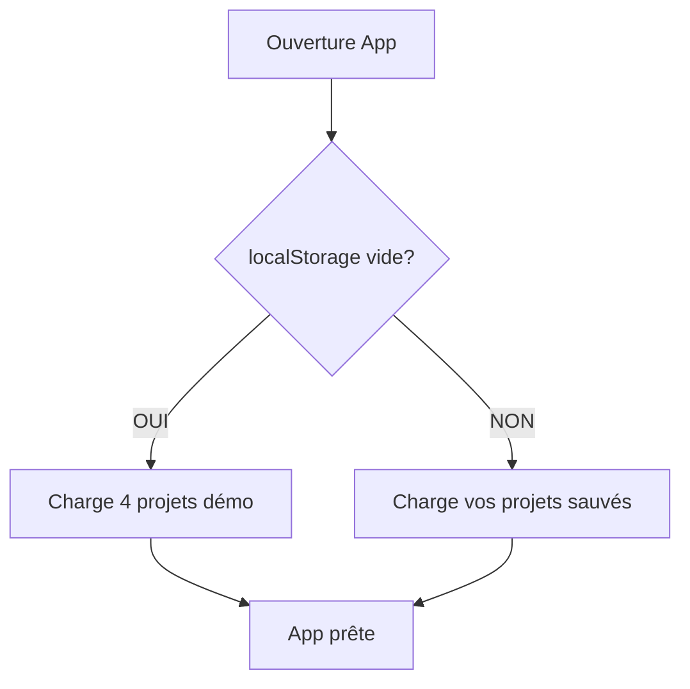

# 🚀 Guide du Flux de Données - IRIM MetaBrain

> Guide simple et pédagogique pour comprendre comment vos données circulent dans l'application

## 📖 Table des matières

1. [Vue d'ensemble](#vue-densemble)
2. [Au démarrage](#au-démarrage)
3. [Pendant l'utilisation](#pendant-lutilisation)
4. [La sauvegarde automatique](#la-sauvegarde-automatique)
5. [La synchronisation cloud](#la-synchronisation-cloud)
6. [Scénarios concrets](#scénarios-concrets)
7. [FAQ](#faq)

---

## Vue d'ensemble

```
Votre cerveau → Clavier → App → localStorage → GitHub Gist → Autre appareil
                              ↑                      ↑
                        (Auto-save)            (Sync manuelle)
```

**3 niveaux de persistance :**
- 🧠 **Mémoire** : Pendant que l'app tourne
- 💾 **localStorage** : Survit au rechargement (automatique)
- ☁️ **GitHub Gist** : Survit au changement d'appareil (manuel)

---

## Au démarrage

### 🎬 Que se passe-t-il quand vous ouvrez l'app ?



### 📦 Les 4 projets démo

Si c'est votre **première utilisation**, l'app crée automatiquement :

1. **IRIM MetaBrain** - Le projet de l'app elle-même
2. **MoodCycle** - App de tracking d'humeur (exemple)
3. **Les Pepettes Zub** - App de finances (exemple)
4. **L'Echo des Rêves** - Projet créatif IA (exemple)

Ces projets contiennent du contenu démo (roadmap, todos) pour vous montrer les possibilités.

---

## Pendant l'utilisation

### 🔄 Le cycle de vie d'une modification

```
1. Vous tapez dans un éditeur Markdown
       ↓ (immédiat)
2. Le composant React se met à jour
       ↓ (immédiat)
3. Le store Zustand est modifié
       ↓ (automatique)
4. localStorage est mis à jour
       ↓
5. ✅ Sauvegarde permanente
```

**Pas de bouton "Sauvegarder" !** Tout est automatique.

### 🗂️ Organisation des données

```
En mémoire (Zustand stores)
├── useProjectMetaStore        → Qui ? Quoi ? Où ?
│   ├── Liste des projets
│   ├── Projet sélectionné
│   └── Catégories
│
└── useProjectDataStore(id)    → Le contenu
    ├── Roadmap (Markdown)
    ├── Todo (Markdown)
    └── États des modules

Dans localStorage (survit au F5)
├── project-meta-store          → ~5 KB
├── project-data-irimmetabrain → ~15 KB
├── project-data-moodcycle     → ~10 KB
└── ...
```

---

## La sauvegarde automatique

### ⚡ C'est instantané !

Chaque fois que vous :
- ✏️ Éditez un roadmap
- ✅ Modifiez un todo
- 🔄 Changez de projet
- 📝 Ajoutez une note

→ **C'est sauvé instantanément dans localStorage**

### 🛡️ Protection contre la perte

- **Crash du navigateur** → ✅ Données safe
- **Fermeture accidentelle** → ✅ Données safe
- **Rechargement (F5)** → ✅ Données safe
- **Coupure de courant** → ✅ Données safe
- **Changement de navigateur** → ❌ Besoin de sync cloud

---

## La synchronisation cloud

### ☁️ Pourquoi synchroniser ?

localStorage est **limité à UN navigateur sur UN ordinateur**.

La sync cloud permet :
- 💻➡️💻 Passer d'un PC à un Mac
- 🏠➡️🏢 Travailler maison/bureau
- 🔒 Backup sécurisé
- 🤝 Partager (avec le mot de passe)

### 🔄 Comment synchroniser ?

#### Export (sauver dans le cloud)

```
1. Cliquez sur 🔄 dans Control Tower
2. Entrez votre token GitHub
3. Définissez un mot de passe (8+ caractères)
4. Cliquez "Exporter"
5. L'ID du Gist est copié 📋
```

#### Import (récupérer du cloud)

```
1. Cliquez sur 🔄 dans Control Tower
2. Entrez votre token GitHub
3. Collez l'ID du Gist
4. Entrez le même mot de passe
5. Cliquez "Importer"
6. Confirmez le remplacement
7. Page rechargée avec vos données ✨
```

### 🔐 Sécurité

- **Chiffrement AES-256** : Illisible sans mot de passe
- **Gist privé** : Invisible publiquement
- **Token temporaire** : Expire après 90 jours
- **Mot de passe local** : Jamais envoyé à GitHub

---

## Scénarios concrets

### 📚 Scénario 1 : "Je débute"

```
1. Ouvrez l'app → 4 projets démo apparaissent
2. Explorez, modifiez → Tout est auto-sauvé
3. Fermez, revenez demain → Vos modifs sont là
```

### 🏠➡️🏢 Scénario 2 : "Maison vers bureau"

```
À la maison :
1. Travaillez sur vos projets
2. Avant de partir : 🔄 → Export
3. Notez l'ID du Gist

Au bureau :
1. Ouvrez l'app (vide ou avec vieux projets)
2. 🔄 → Import avec l'ID
3. Continuez où vous étiez !
```

### 🔄 Scénario 3 : "Sync bidirectionnelle"

```
Matin (PC bureau) :
1. Import du Gist
2. Travaillez
3. Export vers le même Gist

Soir (PC maison) :
1. Import du même Gist (mis à jour)
2. Travaillez
3. Export vers le même Gist

→ Toujours synchronisé !
```

### 🆘 Scénario 4 : "J'ai tout cassé"

```
Si tout bug :
1. Console : localStorage.clear()
2. Rechargez la page (F5)
3. Les 4 projets démo réapparaissent

Si vous aviez un backup :
1. 🔄 → Import du Gist
2. Vos projets reviennent
```

### 🎁 Scénario 5 : "Partager avec un collègue"

```
Vous :
1. Export vers Gist
2. Donnez l'ID + mot de passe

Collègue :
1. Ouvre l'app
2. Import avec ID + mot de passe
3. A exactement les mêmes projets !
```

---

## FAQ

### ❓ "Mes données sont où exactement ?"

```
Pendant utilisation → Mémoire RAM
Après chaque modif → localStorage navigateur
Après export manuel → GitHub Gist chiffré
```

### ❓ "C'est sauvé automatiquement ?"

**OUI !** Pas de Ctrl+S nécessaire. Chaque frappe est sauvée.

### ❓ "Je peux perdre mes données ?"

**Très difficile !** Sauf si :
- Vous videz localStorage manuellement
- Vous n'avez jamais fait d'export cloud
- Vous changez de navigateur sans sync

### ❓ "Le mot de passe, c'est quoi ?"

C'est **votre** mot de passe pour chiffrer les données sur GitHub.
- Choisissez-le vous-même
- Minimum 8 caractères
- Le même pour export/import
- Perdu = données irrécupérables

### ❓ "Token GitHub ?"

C'est une clé pour que l'app puisse créer des Gists en votre nom.
- Créez-le sur GitHub.com
- Scope "gist" uniquement
- Expire après 90 jours
- À renouveler si expiré

### ❓ "Limite de stockage ?"

- **localStorage** : ~10 MB (largement suffisant)
- **GitHub Gist** : 1 MB par fichier (suffisant pour 50+ projets)
- **Projets** : Illimités en théorie

### ❓ "Mode hors-ligne ?"

**100% hors-ligne !** Sauf pour :
- Export vers GitHub (besoin internet)
- Import depuis GitHub (besoin internet)

Tout le reste fonctionne sans connexion.

### ❓ "Multi-utilisateurs ?"

**Non conçu pour ça.** C'est un outil personnel.
Mais vous pouvez partager via Gist + mot de passe.

---

## 🎯 Points clés à retenir

1. **Tout est auto-sauvé** - Pas de stress
2. **localStorage = votre ami** - Survit à tout sauf clear
3. **Sync = backup + multi-device** - Faites-le régulièrement
4. **Mot de passe = clé du coffre** - Ne le perdez pas
5. **4 projets démo** - Pour démarrer rapidement

---

## 🚀 Commandes utiles

```javascript
// Dans la console du navigateur

// Voir l'état actuel
window.stores.projectMeta()

// Voir un projet spécifique
window.stores.projectData('irimmetabrain')

// Changer de projet
window.stores.selectProject('moodcycle')

// Debug complet
window.__DEBUG_STORES__()

// Reset total (attention !)
localStorage.clear() // puis F5
```

---

## 📚 Pour aller plus loin

- [Architecture technique](../architecture/stores-architecture.md)
- [Système de synchronisation](sync-system.md)
- [Changelog des stores](../architecture/CHANGELOG-stores.md)

---

**Besoin d'aide ?** La communauté IRIM est là ! 💜