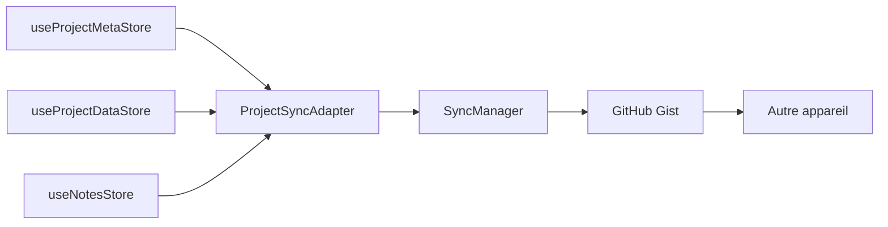

# 🔄 Système de Synchronisation Multi-Device - Documentation Technique

> Documentation technique complète du système de synchronisation

**Dernière mise à jour :** 19 septembre 2025
**Version :** 2.0.0 (Architecture Multi-Stores)

⚠️ **Note :** Pour une explication simple et pédagogique, consultez le [Guide du Flux de Données](data-flow-guide.md)

## 📦 Architecture v2 - Multi-Stores

### Vue d'ensemble du flux



### 1. **Service SyncManager** (`src/services/SyncManager.js`)
Service générique singleton pour la synchronisation chiffrée.

**Méthodes principales :**
- `configure(githubToken, gistId)` - Configure les credentials
- `setPassword(password)` - Définit le mot de passe de chiffrement
- `encrypt(data)` - Chiffre avec AES-256 + PBKDF2 (10k iterations)
- `decrypt(encryptedData)` - Déchiffre les données
- `uploadGist(data, encrypted)` - Upload vers GitHub Gist
- `downloadGist(gistId, encrypted)` - Download depuis GitHub Gist
- `testConnection()` - Vérifie la validité du token
- `listGists()` - Liste les Gists IRIM existants

**Sécurité :**
- AES-256 pour le chiffrement symétrique
- PBKDF2 avec 10000 iterations (dérivation de clé)
- Salt aléatoire pour chaque chiffrement
- IV aléatoire pour chaque bloc

### 2. **Système de modales** (`src/components/common/Modal/`)

**Composant Modal de base :**
- Utilise React Portal pour render au-dessus de tout
- Design aligné sur Tower System (metalBg + primaryLevel)
- Fermeture par Escape ou clic overlay
- Animations fadeIn + slideUp
- Tailles configurables : small, medium, large, fullscreen

**Hook useModal** (`src/hooks/useModal.js`) :
```javascript
const modal = useModal();
// modal.isOpen - état ouvert/fermé
// modal.open(data) - ouvrir avec données optionnelles
// modal.close() - fermer
// modal.toggle() - basculer
```

### 3. **SyncModal spécifique** (`src/components/modals/SyncModal/`)

Interface utilisateur pour la synchronisation :
- Configuration GitHub token
- Mot de passe de chiffrement
- Export/Import des stores
- Liste des Gists existants
- Messages de statut colorés (success/error/info)

### 4. **ProjectSyncAdapter** (`src/services/ProjectSyncAdapter.js`)

**Nouvel adaptateur pour l'architecture multi-stores :**

```javascript
// Méthodes principales
ProjectSyncAdapter.configure(githubToken, gistId)
ProjectSyncAdapter.setPassword(password)
ProjectSyncAdapter.exportToGist(encrypted)
ProjectSyncAdapter.importFromGist(gistId, encrypted)
ProjectSyncAdapter.getSyncStats()
ProjectSyncAdapter.needsSync()
```

**Responsabilités :**
- Collecte données depuis TOUS les stores (Meta + tous les ProjectData)
- Combine en structure unifiée pour export
- Distribue aux bons stores lors de l'import
- Gère la compatibilité v1 → v2

### 5. **Intégration stores Zustand v2**

**Stores actuels :**
- `useProjectMetaStore` - Métadonnées globales des projets
- `useProjectDataStore(id)` - Données spécifiques par projet (dynamique)
- `useNotesStore` - Notes transversales (inchangé)

## 🔑 Configuration GitHub requise

### Personal Access Token
1. GitHub → Settings → Developer settings
2. Personal access tokens → Tokens (classic)
3. Generate new token (classic)
4. **Scope requis :** `gist` (Create gists)
5. Expiration : 90 days recommandé

### Structure du Gist v2

```json
{
  "version": "2.0.0",
  "architecture": "multi-store",
  "timestamp": "2025-09-19T10:00:00Z",
  "stores": {
    "notes": {
      "roomNotes": {...},
      "sideTowerNotes": {...}
    },
    "projectMeta": {
      "selectedProject": "irimmetabrain",
      "visibleProjects": ["id1", "id2"],
      "categories": {...},
      "projects": {
        "id1": { /* métadonnées */ },
        "id2": { /* métadonnées */ }
      }
    },
    "projectData": {
      "id1": {
        "roadmapMarkdown": "...",
        "todoMarkdown": "...",
        "atelierModules": {...}
      },
      "id2": { /* données projet 2 */ }
    }
  }
}
```

**Différences clés v1 → v2 :**
- `projects` → `projectMeta` + `projectData` (séparés)
- `currentProjectId` → `selectedProject`
- Ajout du champ `architecture` pour détection de version

## 🎨 Design System créé

### Styles Modal (`Modal.styles.js`)
- **Overlay** : `alpha(black, 0.6)` + `backdrop-filter: blur(8px)`
- **Container** : `metalBg` + `primaryLevel` du système Tower
- **Header** : `alpha(primary, 0.3)` avec titre uppercase
- **Content** : Scrollable avec custom scrollbar Tower-style
- **Footer** : Pour actions, aligné à droite

### Patterns réutilisables
```javascript
// Import du système
import Modal from 'components/common/Modal/Modal';
import useModal from 'hooks/useModal';

// Usage
const myModal = useModal();

<Modal
  isOpen={myModal.isOpen}
  onClose={myModal.close}
  title="Ma Modal"
  size="medium"
>
  {/* Contenu */}
</Modal>
```

## 🚀 Usage avec la nouvelle architecture

### Export des données

#### Interface utilisateur
1. Cliquer sur 🔄 dans ControlTower
2. Entrer GitHub token
3. Tester connexion
4. Entrer mot de passe (min 8 caractères)
5. Cliquer "Exporter vers GitHub"
6. L'ID du Gist est copié dans le presse-papier

#### Sous le capot
```javascript
// Le ProjectSyncAdapter fait :
1. Collecte useProjectMetaStore.getState()
2. Pour chaque projet, collecte localStorage[`project-data-${id}`]
3. Collecte useNotesStore.getState()
4. Combine tout en structure v2
5. Chiffre avec le mot de passe
6. Upload vers GitHub Gist
```

### Import des données

#### Interface utilisateur
1. Même processus initial
2. Entrer ou récupérer l'ID du Gist
3. Entrer le même mot de passe
4. Cliquer "Importer depuis GitHub"
5. Confirmer le remplacement des données locales
6. Page rechargée automatiquement

#### Sous le capot
```javascript
// Le ProjectSyncAdapter fait :
1. Download le Gist
2. Déchiffre avec le mot de passe
3. Détecte la version (v1 ou v2)
4. Si v1: migre vers v2
5. Distribue dans les stores :
   - projectMeta → localStorage['project-meta-store']
   - projectData.id → localStorage['project-data-{id}']
   - notes → localStorage['irim-notes-store']
6. Recharge la page
```

## 🔒 Sécurité

### Chiffrement
- **Algorithme** : AES-256-CBC
- **Dérivation de clé** : PBKDF2 avec 10000 iterations
- **Salt** : 128 bits aléatoire par chiffrement
- **IV** : 128 bits aléatoire par bloc

### Stockage
- GitHub Gist privé (non listé)
- Token stocké uniquement en mémoire (pas persisté)
- Mot de passe jamais stocké

## 📝 Notes d'apprentissage

### Concepts maîtrisés
1. **React Portals** - Render en dehors du flux DOM
2. **Singleton pattern** - Instance unique de service
3. **Chiffrement symétrique** - AES avec dérivation de clé
4. **GitHub API** - Gestion des Gists via API REST
5. **Custom hooks** - Logique réutilisable d'état

### Points d'attention
- Le token GitHub expire (90 jours par défaut)
- Le mot de passe n'est pas récupérable (pas de "forgot password")
- Les Gists ont une limite de 1MB par fichier
- La synchronisation écrase toutes les données locales

## 🆕 Nouveautés v2.0

### Architecture Multi-Stores
- Séparation métadonnées / données projet
- Stores dynamiques par projet
- Performance améliorée (lazy loading)

### Compatibilité descendante
- Détection automatique v1/v2
- Migration transparente v1 → v2
- Pas de perte de données

### Initialisation robuste
- Données par défaut si localStorage vide
- 4 projets démo pré-configurés
- Détection et réparation stores corrompus

## 🔮 Évolutions futures prévues

1. **Auto-sync périodique**
   - Sync automatique toutes les X minutes
   - Indicateur de statut de sync

2. **Conflict resolution**
   - Comparer timestamps
   - Merger intelligemment les changements

3. **Selective sync**
   - Choisir quels stores synchroniser
   - Sync par room/projet spécifique

4. **Multi-device tracking**
   - Identifier chaque device
   - Historique des sync par device

## 🐛 Debug et diagnostics

### Vérifier l'état actuel

```javascript
// Stores actuels
window.stores.projectMeta()      // Métadonnées
window.stores.projectData('id')  // Données projet

// Stats de sync
import ProjectSyncAdapter from './services/ProjectSyncAdapter'
ProjectSyncAdapter.getSyncStats()

// Debug complet
window.__DEBUG_STORES__()
```

### Vérifier localStorage

```javascript
// Voir toutes les clés
Object.keys(localStorage).filter(k => k.startsWith('project-'))

// Taille des données
const size = key => (localStorage.getItem(key)?.length || 0) / 1024
console.log(`Meta: ${size('project-meta-store')} KB`)
console.log(`Data: ${size('project-data-irimmetabrain')} KB`)
```

### Réinitialisation

```javascript
// Reset complet avec données démo
import { resetToDefaultData } from './stores/migrateProjectStores'
await resetToDefaultData()

// Ou manuellement
localStorage.clear()
window.location.reload()
```

### Erreurs communes
- **"GitHub token not configured"** : Token non entré
- **"Wrong password?"** : Mot de passe incorrect pour déchiffrer
- **"401 Unauthorized"** : Token expiré ou invalide
- **"404 Not Found"** : Gist ID incorrect

### Test du chiffrement

```javascript
// Tester le chiffrement local
import SyncManager from './services/SyncManager'
const encrypted = SyncManager.encrypt({test: "data"}, "password123")
const decrypted = SyncManager.decrypt(encrypted, "password123")
console.log(decrypted) // {test: "data"}
```

### Test de sync complète

```javascript
// Export manuel
import ProjectSyncAdapter from './services/ProjectSyncAdapter'
ProjectSyncAdapter.configure('ghp_yourtoken', null)
ProjectSyncAdapter.setPassword('yourpassword')
const result = await ProjectSyncAdapter.exportToGist(true)
console.log('Gist ID:', result.id)

// Import manuel
const importResult = await ProjectSyncAdapter.importFromGist(result.id, true)
console.log('Import:', importResult)
```

## 📚 Documentation liée

- [🚀 Guide utilisateur simple](data-flow-guide.md) - Pour comprendre le flux
- [🏗️ Architecture des stores](../architecture/stores-architecture.md) - Détails techniques
- [📋 Changelog](../architecture/CHANGELOG-stores.md) - Historique des changements

---

**Mainteneurs :** IRIM Team
**Statut :** ✅ Production Ready (v2.0.0)
**Licence :** MIT
